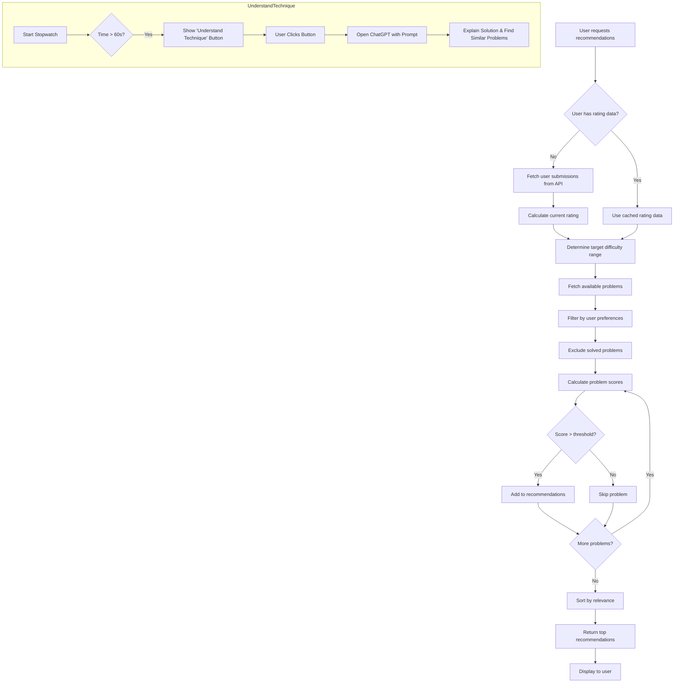

# Activity Diagram - Problem Recommendation Process

```mermaid
graph TD
    A[User requests recommendations] --> B{User has rating data?}
    B -->|No| C[Fetch user submissions from API]
    B -->|Yes| D[Use cached rating data]

    C --> E[Calculate current rating]
    E --> F[Determine target difficulty range]

    D --> F

    F --> G[Fetch available problems]
    G --> H[Filter by user preferences]
    H --> I[Exclude solved problems]
    I --> J[Calculate problem scores]

    J --> K{Score > threshold?}
    K -->|Yes| L[Add to recommendations]
    K -->|No| M[Skip problem]

    L --> N{More problems?}
    M --> N

    N -->|Yes| J
    N -->|No| O[Sort by relevance]
    O --> P[Return top recommendations]
    P --> Q[Display to user]

    subgraph UnderstandTechnique
        S1[Start Stopwatch] --> S2{Time > 60s?}
        S2 -->|Yes| S3[Show 'Understand Technique' Button]
        S3 --> S4[User Clicks Button]
        S4 --> S5[Open ChatGPT with Prompt]
        S5 --> S6[Explain Solution & Find Similar Problems]
    end
```