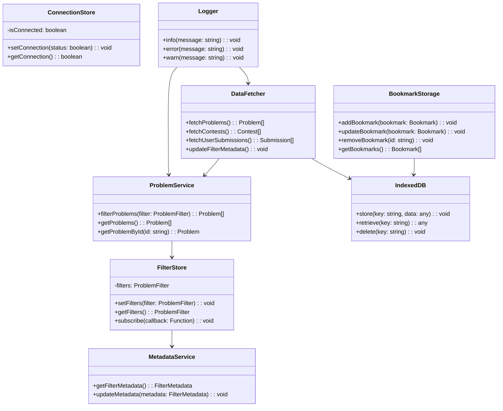

# Class Diagram - CF-Mentor Chrome Extension

```mermaid
classDiagram
    class DataFetcher {
        +fetchProblems(): Problem[]
        +fetchContests(): Contest[]
        +fetchUserSubmissions(): Submission[]
        +updateFilterMetadata(): void
    }

    class ProblemService {
        +filterProblems(filter: ProblemFilter): Problem[]
        +getProblems(): Problem[]
        +getProblemById(id: string): Problem
    }

    class FilterStore {
        -filters: ProblemFilter
        +setFilters(filter: ProblemFilter): void
        +getFilters(): ProblemFilter
        +subscribe(callback: Function): void
    }

    class ConnectionStore {
        -isConnected: boolean
        +setConnection(status: boolean): void
        +getConnection(): boolean
    }

    class BookmarkStorage {
        +addBookmark(bookmark: Bookmark): void
        +updateBookmark(bookmark: Bookmark): void
        +removeBookmark(id: string): void
        +getBookmarks(): Bookmark[]
    }

    class MetadataService {
        +getFilterMetadata(): FilterMetadata
        +updateMetadata(metadata: FilterMetadata): void
    }

    class IndexedDB {
        +store(key: string, data: any): void
        +retrieve(key: string): any
        +delete(key: string): void
    }

    class Logger {
        +info(message: string): void
        +error(message: string): void
        +warn(message: string): void
    }

    DataFetcher --> ProblemService
    ProblemService --> FilterStore
    FilterStore --> MetadataService
    BookmarkStorage --> IndexedDB
    DataFetcher --> IndexedDB
    Logger --> DataFetcher
    Logger --> ProblemService
```