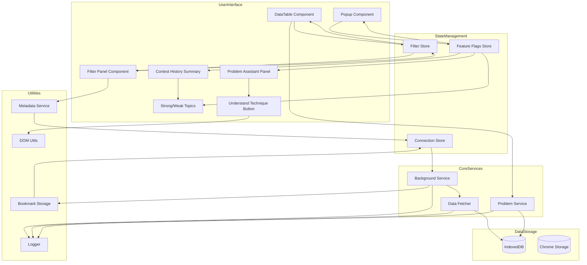

# Component Diagram - CF-Mentor System Components

```mermaid
graph TD
    subgraph UserInterface
        POP[Popup Component]
        DT[DataTable Component]
        FP[Filter Panel Component]
        PAP[Problem Assistant Panel]
        CHS[Contest History Summary]
        SWT[Strong/Weak Topics]
        UT[Understand Technique Button]
    end

    subgraph CoreServices
        BG[Background Service]
        DF[Data Fetcher]
        PS[Problem Service]
    end

    subgraph StateManagement
        FS[Filter Store]
        CS[Connection Store]
        FFS[Feature Flags Store]
    end

    subgraph DataStorage
        IDB[(IndexedDB)]
        CHS_STORE[(Chrome Storage)]
    end

    subgraph Utilities
        BS[Bookmark Storage]
        MS[Metadata Service]
        LOG[Logger]
        DU[DOM Utils]
    end

    POP --> FFS
    DT --> FS
    FP --> FS
    DT --> PS
    FP --> MS

    BG --> DF
    BG --> BS
    DF --> IDB
    BS --> CS

    PS --> IDB
    MS --> CS

    BG --> LOG
    DF --> LOG
    PS --> LOG

    FS --> DT
    FS --> FP
    CS --> BG
    FFS --> POP
    FFS --> PAP
    FFS --> CHS
    FFS --> SWT
    
    CHS --> SWT
    PAP --> UT
    UT --> DU
```