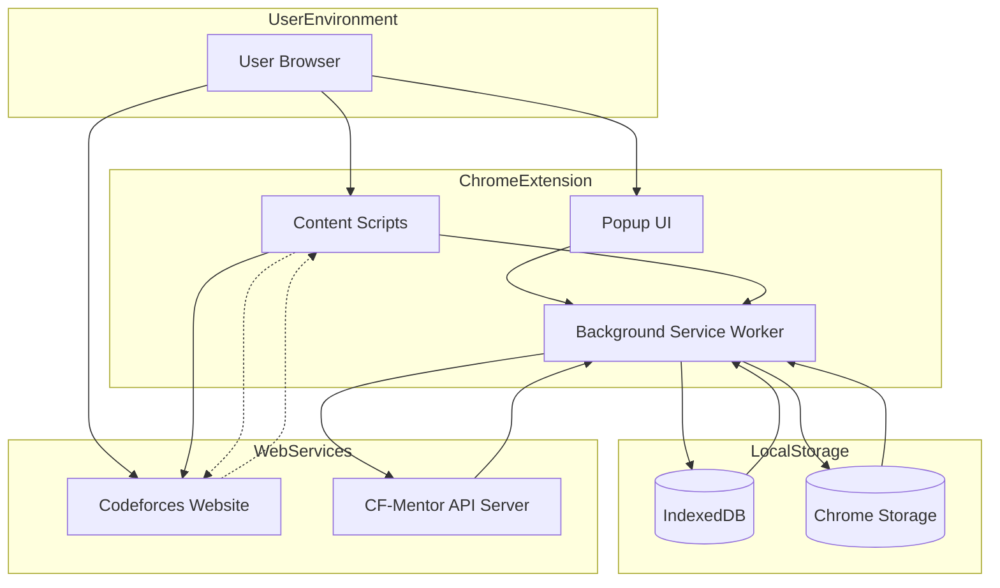

# Deployment Diagram - CF-Mentor Chrome Extension Architecture

```mermaid
graph TD
    subgraph UserEnvironment
        UB[User Browser]
    end

    subgraph ChromeExtension
        BG[Background Service Worker]
        POP[Popup UI]
        CS[Content Scripts]
    end

    subgraph WebServices
        CF[Codeforces Website]
        API[CF-Mentor API Server]
    end

    subgraph LocalStorage
        IDB[(IndexedDB)]
        CHST[(Chrome Storage)]
    end

    UB --> POP
    UB --> CS
    UB --> CF

    POP --> BG
    CS --> BG
    CS --> CF

    BG --> API
    BG --> IDB
    BG --> CHST

    API --> BG
    IDB --> BG
    CHST --> BG

    CF -.-> CS
    CS -.-> CF
```