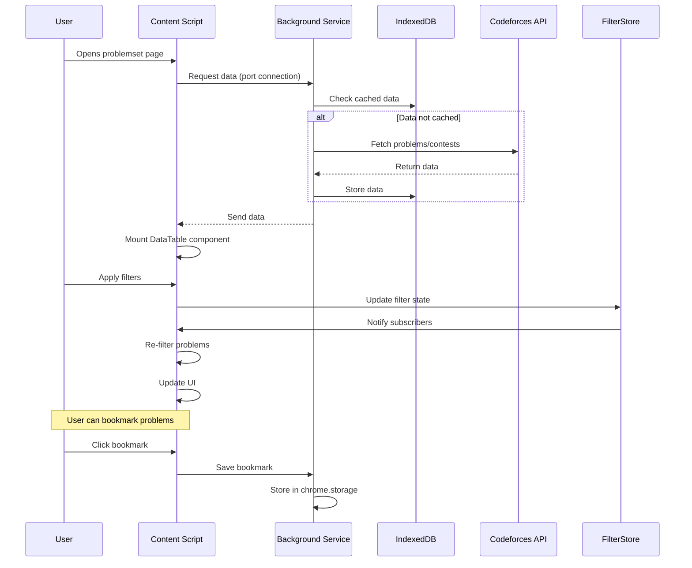

# Sequence Diagram - Data Fetching and Filtering Workflow

```mermaid
sequenceDiagram
    participant U as User
    participant CS as Content Script
    participant BG as Background Service
    participant IDB as IndexedDB
    participant API as Codeforces API
    participant FS as FilterStore

    U->>CS: Opens problemset page
    CS->>BG: Request data (port connection)
    BG->>IDB: Check cached data
    alt Data not cached
        BG->>API: Fetch problems/contests
        API-->>BG: Return data
        BG->>IDB: Store data
    end
    BG-->>CS: Send data
    CS->>CS: Mount DataTable component

    U->>CS: Apply filters
    CS->>FS: Update filter state
    FS->>CS: Notify subscribers
    CS->>CS: Re-filter problems
    CS->>CS: Update UI

    Note over U,CS: User can bookmark problems
    U->>CS: Click bookmark
    CS->>BG: Save bookmark
    BG->>BG: Store in chrome.storage
```