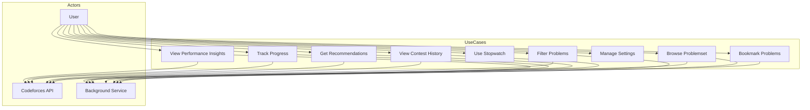

# Use Case Diagram - CF-Mentor Chrome Extension

```mermaid
graph TD
    subgraph Actors
        U[User]
        CF[Codeforces API]
        BG[Background Service]
    end

    subgraph UseCases
        UC1[Browse Problemset]
        UC2[Filter Problems]
        UC3[Bookmark Problems]
        UC4[View Contest History]
        UC5[Use Stopwatch]
        UC6[Get Recommendations]
        UC7[Manage Settings]
        UC8[Track Progress]
        UC9[View Performance Insights]
    end

    U --> UC1
    U --> UC2
    U --> UC3
    U --> UC4
    U --> UC5
    U --> UC6
    U --> UC7
    U --> UC8
    U --> UC9

    UC1 --> CF
    UC2 --> CF
    UC4 --> CF
    UC6 --> CF
    UC8 --> CF
    UC9 --> CF

    UC1 --> BG
    UC2 --> BG
    UC3 --> BG
    UC4 --> BG
    UC6 --> BG
    UC8 --> BG
    UC9 --> BG
```