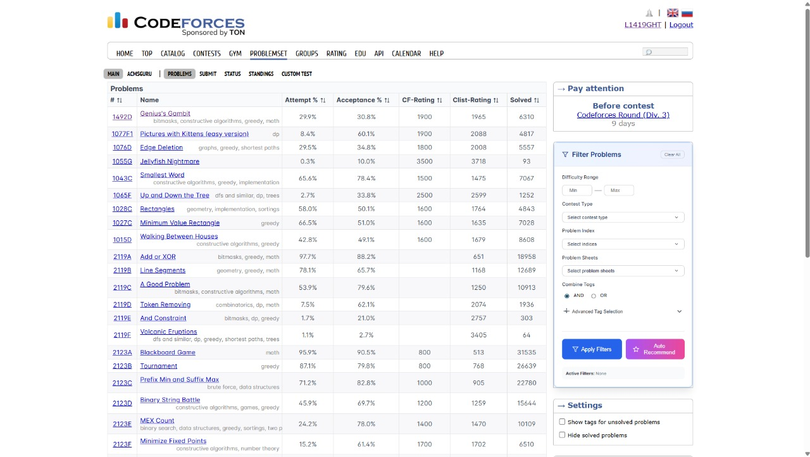
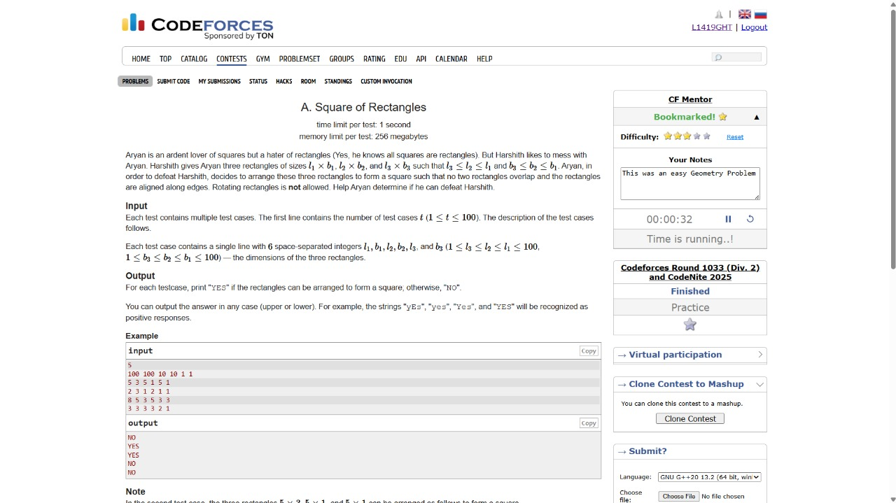

# CF Mentor Extension 🚀


**CF Mentor** is a Chrome extension designed to **supercharge your Codeforces practice**. It seamlessly integrates into the Codeforces interface, giving you advanced problem filtering, in-page notes, ratings, bookmarks, and a stopwatch — all without leaving the site.

## 📸 Screenshots

**Problems Page with Filters & Ratings**


**In-Page Notes & Stopwatch**


## ✨ Features

CF Mentor enhances your Codeforces experience with:

* ⏱ **Stopwatch & Session Tracking** Time your problem-solving sessions, pause/resume anytime, and track how long you spend on each problem.
* ⭐ **Bookmarks & Custom Difficulty Ratings** Save problems for later and assign difficulty ratings that fit your training style.
* 📊 **Two Rating Modes** Choose between **Codeforces original rating** or **Clist rating** for problem difficulty display.
* 📝 **In-Page Notes** Write and save notes directly on problem pages — ideas, solutions, or reminders are always right where you need them.
* 🔍 **Advanced Problem Filtering** Search by tags, difficulty range, solved status, problem index, and even combine tags with AND/OR logic.
* 📅 **Before Contest Reminder** A small heads-up before upcoming Codeforces contests so you never miss them.

## 🛠 Installation & Setup

1. **Clone the Repository**

```bash
git clone https://github.com/your-username/CF-Mentor.git
cd CF-Mentor
```

2. **Install Dependencies**

```bash
npm install
```

3. **Build the Extension**

```bash
npm run build
```

This will generate the distributable files inside the `dist/` folder.

4. **Load into Chrome**
   * Open `chrome://extensions/`
   * Enable **Developer Mode** (toggle in the top-right)
   * Click **"Load unpacked"**
   * Select the `dist` directory from this project

✅ You're ready! The CF Mentor icon will appear in your toolbar, and its features will activate automatically on Codeforces.

## 📂 Project Structure

```
.
├── dist/             # Build output (generated after npm run build)
├── public/           # Static assets (icons, manifest.json)
└── src/              # Source code
    ├── background/   # Background service worker
    ├── content/      # Scripts injected into Codeforces pages
    ├── popup/        # Popup UI components
    └── shared/       # Utilities & shared logic
```

## 🤝 Contributing

We welcome contributions!

1. Fork the repository
2. Create a feature branch (`git checkout -b feature/NewFeature`)
3. Commit changes (`git commit -m 'Add NewFeature'`)
4. Push to your branch (`git push origin feature/NewFeature`)
5. Open a Pull Request

## 📄 License

Distributed under the MIT License. See `LICENSE` for details.
